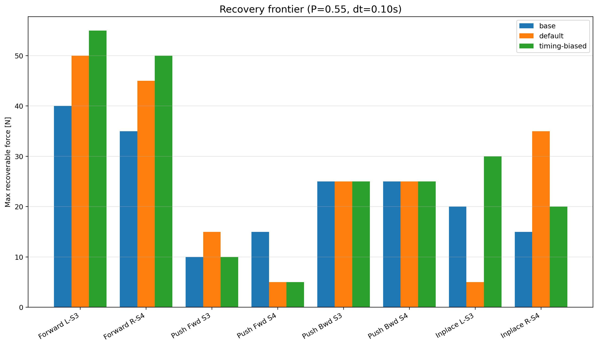
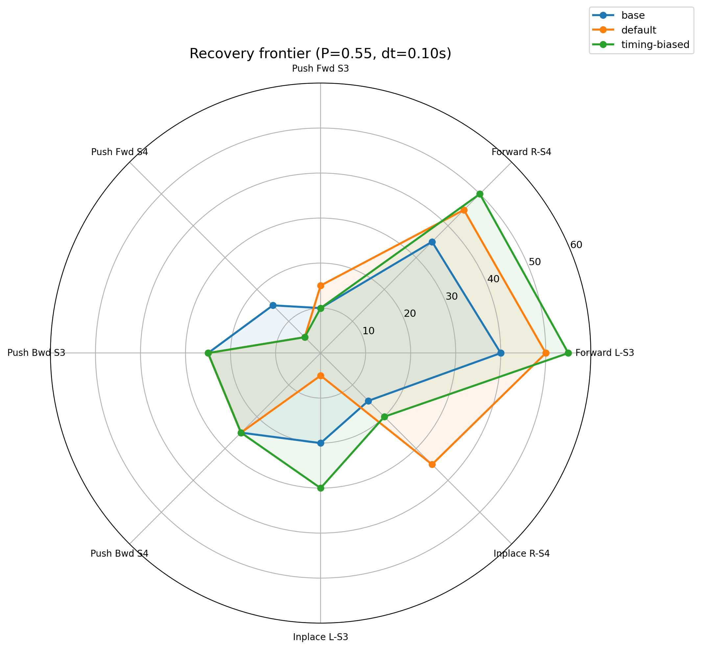
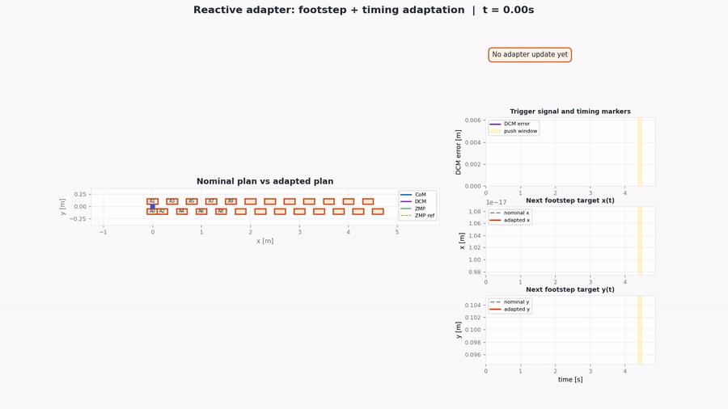
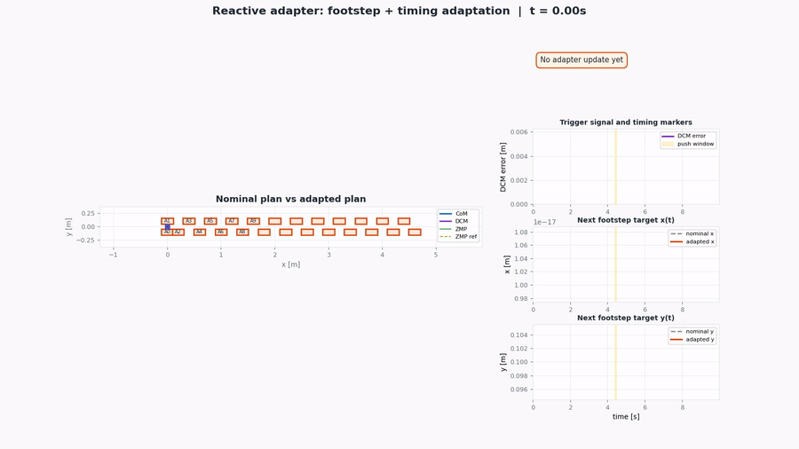
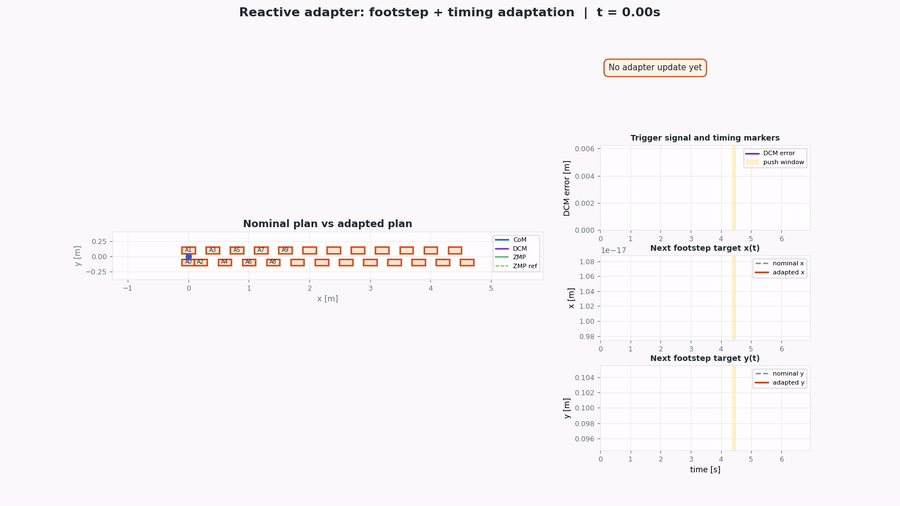

# Reactive Step Timing Adaptation for IS-MPC Humanoid Locomotion

This repository extends the DIAG Robotics Lab IS-MPC humanoid walking framework with a reactive step adaptation layer for push recovery.

The original framework provides nominal footstep planning, IS-MPC CoM/ZMP regulation, swing-foot trajectory generation, inverse dynamics control, and DART-based simulation. This project adds an online layer that can update the active footstep plan during walking by modifying:

- the position of the next footstep;
- the duration of the current or next single-support phase.

The implementation is inspired by Khadiv et al., *Walking Control Based on Step Timing Adaptation*, but it is not a direct reimplementation. The goal is to keep the original IS-MPC architecture mostly unchanged and add a lightweight reactive overlay on top of it.

---

## Overview

A nominal walking controller follows a fixed footstep plan. This works well in unperturbed walking, but external pushes can make the original plan insufficient. The idea of this project is to keep two plans:

- a **nominal plan**, used as the original reference;
- an **active plan**, which can be updated online when a disturbance is detected.

The reactive adapter is gated: it stays inactive during nominal walking and intervenes only when the robot is in single support and the DCM/viability conditions indicate that the current plan may not be sufficient.

The strongest result is obtained in forward walking under lateral body pushes toward the unsupported side. In this regime, the adapter improves the maximum recoverable push force compared with the baseline IS-MPC controller.

---

## Main results

Final results are evaluated with:

```text
simulation horizon: 1000 ticks
push phase:        0.55
push duration:     0.10 s
push target:       base
```

| Scenario | Baseline | Default adapter | Timing-biased adapter |
|---|---:|---:|---:|
| Forward L-S3 | 40 N | 50 N | 55 N |
| Forward R-S4 | 35 N | 45 N | 50 N |

The default adapter improves robustness mainly through online next-footstep relocation. The timing-biased variant confirms that the timing branch is functional and can further improve selected cases, but it is more tuning-sensitive and can introduce regressions.

Therefore, the default adapter should be considered the stable controller, while the timing-biased mode should be treated as an ablation/diagnostic extension.

---

## Example figures

If the generated assets are available, the main recovery-frontier plots can be shown directly in the README.

<p align="center">
  
</p>

<p align="center">
  
</p>

---

## Visual examples

The repository can also include lightweight GIFs generated from selected simulation traces. These are useful to show the qualitative difference between the baseline controller and the adapted controller.

### Baseline failure

<p align="center">
  
</p>

### Default adapter recovery

<p align="center">
  
</p>

### Timing-biased adapter

<p align="center">
  
</p>

If the GIFs are too large for GitHub, keep only the most representative one or replace them with links to the corresponding MP4 files in `viz_final_1000/`.

---

## Repository structure

| Path | Description |
|---|---|
| `simulation.py` | Main simulation entry point, CLI, push scheduling, logging, adapter setup |
| `step_timing_adapter.py` | Reactive QP layer for footstep and timing adaptation |
| `footstep_planner.py` | Nominal and active footstep plans |
| `foot_trajectory_generator.py` | Swing-foot trajectory generation from the active plan |
| `ismpc.py` | IS-MPC controller backbone |
| `inverse_dynamics.py` | Whole-body inverse dynamics |
| `filter.py` | CoM/ZMP state filtering |
| `logger.py` | Runtime/debug plotting utilities |
| `show_results.py` | Aggregates JSON logs and prints result summaries |
| `plot_better_recovery_radar.py` | Generates recovery-frontier bar/radar plots |
| `plot_adapter_trace_fancy.py` | Generates dashboard plots and plan animations |
| `run_all_tests.sh` | Baseline and default-adapter test battery |
| `run_timing_biased_on_old_tests.sh` | Timing-biased ablation battery |
| `run_gapfill_tests_1000.sh` | Additional tests for gap-filled recovery-frontier plots |
| `logs_final_1000/` | Final baseline/default-adapter logs |
| `logs_timing_biased_full_1000/` | Final timing-biased logs |
| `logs_gapfill_1000/` | Additional gap-filling logs |
| `plots_final_1000/` | Final recovery-frontier plots |
| `viz_final_1000/` | Trace dashboards and animations |
| `docs/assets/` | README-ready figures and optional animations |
| `archives/` | Older logs, plots, and scripts |

---

## Method

The adapter is inserted between the walking state estimation/planning logic and the IS-MPC/swing-foot modules.

At each simulation tick:

1. the simulator reads the current walking state;
2. the adapter checks whether intervention is allowed;
3. if the activation gates are satisfied, it solves a local QP;
4. if the QP solution is accepted, the active footstep plan is updated;
5. IS-MPC and swing-foot generation continue using the updated active plan.

This keeps the original walking controller largely intact. The adapter only modifies the reference plan used by the existing pipeline.

---

## Adapter logic

The reactive QP can update both spatial and temporal quantities.

| Variable | Meaning |
|---|---|
| `dx` | next-step displacement along the local x direction |
| `dy` | next-step displacement along the local y direction |
| `tau` | timing-related decision variable |
| `bx`, `by` | DCM offset variables |
| `sx`, `sy` | slack variables |

The adapter is not always active. It can intervene only when the main conditions are satisfied:

- adaptation is enabled with `--adapt`;
- the robot is in single support;
- a valid next step exists;
- the current tick is outside the warmup, freeze, and cooldown windows;
- the DCM/viability trigger indicates that the current plan may be insufficient.

The implementation also includes practical safeguards such as timing bounds, minimum update thresholds, displacement clamps, and soft propagation to the following step.

---

## Running simulations

### Baseline

```bash
python3 simulation.py --headless --steps 1000 \
  --profile forward \
  --force 45 --duration 0.10 --direction left \
  --push-step 3 --push-phase 0.55 --push-target base
```

### Default adapter

```bash
python3 simulation.py --headless --steps 1000 \
  --profile forward --adapt \
  --force 45 --duration 0.10 --direction left \
  --push-step 3 --push-phase 0.55 --push-target base
```

### Timing-biased adapter

```bash
python3 simulation.py --headless --steps 1000 \
  --profile forward --adapt --timing-biased \
  --force 50 --duration 0.10 --direction left \
  --push-step 3 --push-phase 0.55 --push-target base
```

---

## Useful CLI arguments

| Argument | Description |
|---|---|
| `--adapt` | Enables the reactive adapter |
| `--timing-biased` | Enables the timing-biased diagnostic tuning |
| `--headless` | Runs the simulation without viewer |
| `--steps N` | Sets the maximum simulation horizon |
| `--profile forward/inplace/scianca` | Selects the walking profile |
| `--force F` | Push force in Newtons |
| `--duration D` | Push duration in seconds |
| `--direction left/right/forward/backward` | Push direction |
| `--push-step S` | Step index where the push is applied |
| `--push-phase P` | Fraction of the single-support phase where the push is applied |
| `--push-target base/stance_foot/lfoot/rfoot` | Push target |
| `--log-json PATH` | Saves a JSON trace |
| `--quiet` | Reduces console output |

---

## Evaluation workflow

Run the final 1000-tick evaluation battery:

```bash
chmod +x run_final_1000_pipeline.sh
./run_final_1000_pipeline.sh
```

Run the gap-filling battery:

```bash
chmod +x run_gapfill_tests_1000.sh
./run_gapfill_tests_1000.sh
```

Aggregate the results:

```bash
python3 show_results.py \
  logs_final_1000 \
  logs_timing_biased_full_1000 \
  logs_gapfill_1000
```

Generate the main recovery-frontier plots:

```bash
python3 plot_better_recovery_radar.py \
  --logs logs_final_1000 logs_timing_biased_full_1000 logs_gapfill_1000 \
  --phase 0.55 \
  --duration 0.10 \
  --complete-only \
  --outdir plots_final_1000/gapfilled_p055_short
```

The main outputs are:

```text
plots_final_1000/gapfilled_p055_short/recovery_bar_clean.png
plots_final_1000/gapfilled_p055_short/recovery_radar_clean.png
```

To copy the main README figures:

```bash
mkdir -p docs/assets

cp plots_final_1000/gapfilled_p055_short/recovery_bar_clean.png    docs/assets/recovery_frontier_p055_dt010_bar.png

cp plots_final_1000/gapfilled_p055_short/recovery_radar_clean.png    docs/assets/recovery_frontier_p055_dt010_radar.png
```

To generate GIFs from selected animations:

```bash
mkdir -p docs/assets

ffmpeg -y -i viz_final_1000/A_fwd_base_F45_P055_left_S3_timing_animation.mp4   -vf "fps=12,scale=900:-1:flags=lanczos"   docs/assets/anim_forward_45N_baseline.gif

ffmpeg -y -i viz_final_1000/A_fwd_adapt_F45_P055_left_S3_timing_animation.mp4   -vf "fps=12,scale=900:-1:flags=lanczos"   docs/assets/anim_forward_45N_default_adapter.gif

ffmpeg -y -i viz_final_1000/F_frontier_timing_biased_F50_P055_left_S3_timing_animation.mp4   -vf "fps=12,scale=900:-1:flags=lanczos"   docs/assets/anim_forward_50N_timing_biased.gif
```

---

## Timing-biased ablation

The timing-biased mode is enabled with:

```bash
--timing-biased
```

It changes the QP tuning to make timing updates easier to accept. This mode is useful to verify that the timing branch of the adapter is active.

Example timing update:

```text
[adapter] t=0443 step=3 err=0.0025 margin=0.1814
ss:70->71
xy:(0.600,-0.100)->(0.562,-0.051)
```

This update changes both the single-support duration and the next footstep target. The recovery is therefore spatio-temporal: timing adaptation should not be presented as the only cause of the improvement.

Final timing-biased comparison:

```text
matched timing-biased cases:        64
saves vs baseline:                  14
improvements over default adapter:   9
same category as default adapter:   53
worse than default adapter:          2
```

---

## Limitations

The current implementation should not be interpreted as a general push-recovery controller.

The strongest and most reliable result is forward walking under lateral pushes toward the unsupported side. Other regimes are less consistent:

- sagittal pushes are not cleanly solved;
- long pushes remain difficult;
- in-place stepping gives mixed results;
- timing-biased adaptation can improve some cases but regress others;
- slippage tests are not part of the final supported claim.

A fair summary is:

> The project demonstrates that a lightweight reactive footstep adaptation layer can improve selected humanoid push-recovery cases inside an existing IS-MPC walking stack. Timing adaptation is functional, but still tuning-sensitive.

---

## References

- M. Khadiv, A. Herzog, S. A. A. Moosavian, and L. Righetti, *Walking Control Based on Step Timing Adaptation*, arXiv:1704.01271.
- N. Scianca, D. De Simone, L. Lanari, and G. Oriolo, *MPC for Humanoid Gait Generation: Stability and Feasibility*, IEEE Transactions on Robotics, 2020.
- DIAG Robotics Lab IS-MPC framework.
