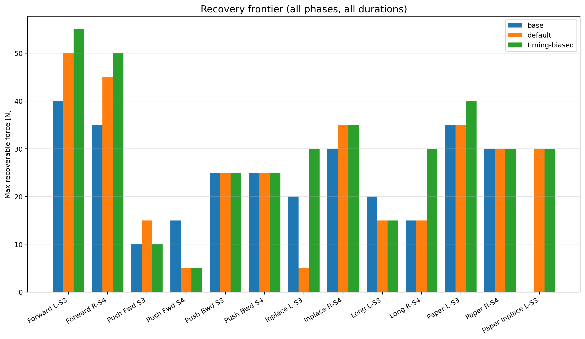
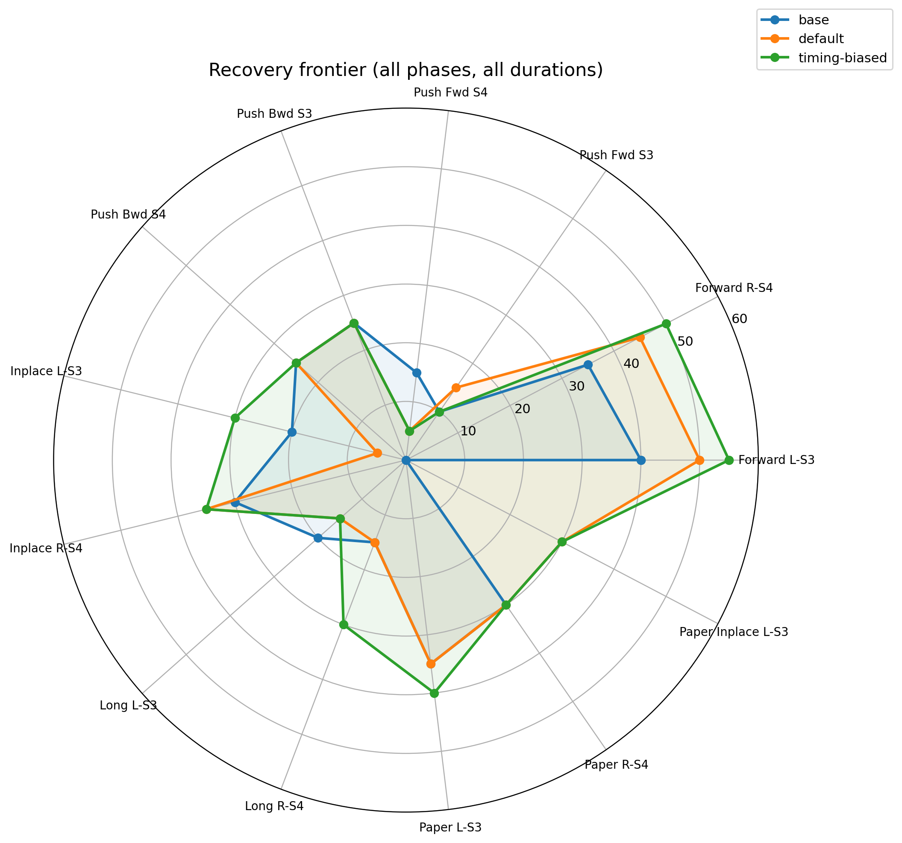
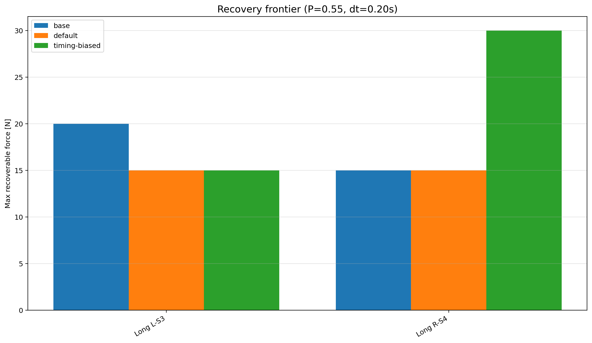
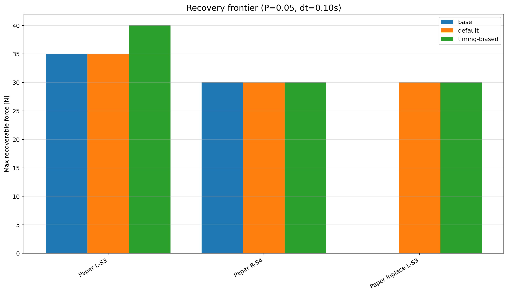

# Reactive Step Timing Adaptation for IS-MPC Humanoid Locomotion

> Final README update for the 1000-step evaluation, gap-filled recovery-frontier plots, timing-biased ablation, animations, and presentation generation.  
> Last updated: 2026-04-29

This repository extends the DIAG Robotics Lab **IS-MPC humanoid walking framework** with a **reactive step adaptation layer** for push recovery. The original framework already provides nominal footstep planning, IS-MPC CoM/ZMP regulation, swing-foot trajectory generation, inverse dynamics, and DART-based simulation. This project adds an online recovery layer that can modify:

- **where** the next footstep lands;
- **when** the current/next step ends, through online single-support duration updates.

The implementation is inspired by Khadiv et al., *Walking Control Based on Step Timing Adaptation*, but it is **not** a direct reimplementation of that paper. The project keeps the original DIAG IS-MPC architecture and adds a gated, reactive QP layer on top of the existing planner/controller pipeline.

---

## Executive summary

The project demonstrates that a lightweight reactive layer can improve humanoid push recovery without redesigning the whole walking controller.

The strongest and cleanest result is in **forward walking with lateral body pushes toward the unsupported side**. In this regime, the adapter increases the maximum recoverable push force compared with the baseline controller.

The most important final result is obtained in the standard setting:

```text
push phase: P = 0.55
push duration: dt = 0.10 s
simulation horizon: 1000 steps
```

| Scenario | Baseline | Default adapter | Timing-biased adapter |
|---|---:|---:|---:|
| Forward L-S3 | 40 N | 50 N | 55 N |
| Forward R-S4 | 35 N | 45 N | 50 N |

Interpretation:

> The default adapter improves forward-walking lateral push robustness mainly through online next-footstep relocation. The timing-biased variant confirms that the timing branch is functional and can further improve the recovery frontier in selected cases, but it is more tuning-sensitive and can introduce regressions. Therefore, the default adapter should be presented as the stable controller, while timing-biased adaptation should be presented as an ablation/diagnostic extension.

---

## What changed in this final version

Compared with the previous project state, the repository now includes:

1. **Uniform 1000-step evaluation**
   - Final plots are based on a common 1000-step horizon.
   - This avoids mixing older runs at 900, 1000, and 1400 steps.

2. **Three-controller comparison**
   - Baseline IS-MPC.
   - Default reactive adapter.
   - Timing-biased reactive adapter.

3. **Gap-filled recovery-frontier plots**
   - Extra low-force tests fill previously empty regions in the radar/bar plots.
   - Untested categories are no longer confused with real `0 N` recovery.

4. **Timing-biased diagnostic mode**
   - Enabled with `--timing-biased`.
   - Makes timing updates cheaper and footstep relocation more expensive in the QP.
   - Confirms that the single-support duration can change online.

5. **Presentation-ready assets**
   - Clean bar/radar plots.
   - Dashboard traces.
   - Plan/timing animations.
   - Optional GIFs for README and slide decks.

---

## Repository structure

| File / folder | Role |
|---|---|
| `simulation.py` | Main entry point: viewer/headless simulation, push scheduling, CLI, JSON logs, adapter setup |
| `step_timing_adapter.py` | Core reactive QP layer for step location and timing adaptation |
| `footstep_planner.py` | Nominal and active footstep plans; supports online updates |
| `foot_trajectory_generator.py` | Swing-foot trajectory generation; consumes the active plan |
| `ismpc.py` | Original IS-MPC controller backbone; reads the active plan |
| `inverse_dynamics.py` | Whole-body inverse dynamics |
| `filter.py` | CoM/ZMP state filtering |
| `logger.py` | Realtime/debug plotting |
| `utils.py` | Helper utilities and QP wrappers |
| `show_results.py` | Aggregates JSON logs and prints result summaries |
| `run_all_tests.sh` | Baseline + default adapter final battery |
| `run_timing_biased_on_old_tests.sh` | Reruns adapted scenarios with `--timing-biased` |
| `run_gapfill_tests_1000.sh` | Additional low-force tests used to fill missing frontier categories |
| `plot_better_recovery_radar.py` | Clean radar/bar plots for max recoverable force |
| `plot_adapter_trace_fancy.py` | Publication-style dashboard and nominal/adapted plan animation |
| `plot_adapter_trace_timing.py` | Timing-focused trace visualization |
| `plot_adapter_trace_timing_pretty.py` | Improved timing/footstep visualization |
| `logs_final_1000/` | Final baseline + default adapter logs |
| `logs_timing_biased_full_1000/` | Final timing-biased logs |
| `logs_gapfill_1000/` | Gap-filling tests for missing radar/bar categories |
| `plots_final_1000/` | Final plots for the presentation |
| `viz_final_1000/` | Final dashboard/animation assets |
| `docs/assets/` | README/presentation-ready figures and optional GIFs |
| `archives/` | Archived old logs, scripts, plots, and previous results |

---

## Scientific motivation

A nominal offline footstep plan is rigid. It can work in unperturbed walking, but under external pushes the robot may need to quickly adjust its next step.

The reference paper by Khadiv et al. shows that, under a simplified LIPM/DCM model, adapting the **next footstep location** and **step timing** can preserve viability. The key idea is that the robot does not need to replan the whole gait; it can react by modifying only the next step.

In this project, the goal is more conservative:

> Keep the original DIAG IS-MPC walking pipeline intact, and add a local reactive layer that intervenes only when the current plan appears insufficient.

This makes the project valuable because it tests whether step timing/location adaptation can be integrated into an existing humanoid MPC framework without replacing the whole controller.

---

## Baseline architecture

The original DIAG IS-MPC pipeline can be summarized as:

1. Generate a nominal footstep plan.
2. Use IS-MPC to regulate CoM/ZMP motion over the planned footsteps.
3. Generate swing-foot trajectories from the planned footstep sequence.
4. Use inverse dynamics to compute torques.
5. Simulate the humanoid in DART.

The baseline controller uses fixed timing and fixed footstep positions. Once the walk starts, the nominal plan is not reactively modified in response to pushes.

---

## Added reactive architecture

The new architecture inserts a reactive adapter between state estimation/planning and the IS-MPC/swing-foot modules.

At each tick:

1. The simulator obtains current CoM/DCM/ZMP-related state.
2. The adapter checks whether it is allowed to intervene.
3. If activation conditions are satisfied, it solves a local QP.
4. If the QP solution is accepted, it updates the active footstep plan.
5. IS-MPC and swing-foot generation continue using the updated active plan.

The key architectural design is the separation between:

- **nominal plan**: immutable reference gait;
- **active plan**: mutable plan used online by MPC and swing-foot generation.

This makes the implementation relatively non-invasive: the original controller still solves the main walking problem, but the reference plan can be updated online.

---

## `step_timing_adapter.py`

This file is the core contribution.

### Decision variables

| Variable | Meaning |
|---|---|
| `dx` | next-step x displacement in support/local frame |
| `dy` | next-step y displacement in support/local frame |
| `tau` | timing variable / timing-related decision |
| `bx`, `by` | DCM offset variables |
| `sx`, `sy` | slack variables |

The adapter can therefore modify both the **spatial target** of the next step and the **temporal duration** of the active single-support step.

### Activation gates

The adapter is intentionally not always active. It can intervene only if:

- `--adapt` is enabled;
- the robot is in single support;
- the current step is valid;
- a next step exists;
- the system is outside the warmup window;
- the system is outside the freeze window near touchdown;
- the system is outside the cooldown window after a previous accepted update.

Then at least one disturbance/viability trigger must hold:

- DCM error is above threshold;
- or viability margin is small enough and DCM error is also non-negligible.

This makes the layer **reactive but gated**, reducing jitter and avoiding unnecessary plan changes during nominal walking.

### Practical safeguards

The adapter includes:

- warmup ticks;
- freeze ticks;
- cooldown ticks;
- `T_gap` clamp;
- timing bounds: `T_min_ticks`, `T_max_ticks`;
- minimum timing update threshold;
- minimum step displacement update threshold;
- per-update displacement clamp;
- soft propagation to step N+2.

These mechanisms prevent unstable plan changes and avoid accepting negligible or too-late updates.

---

## `simulation.py`

Important flags:

| Argument | Description |
|---|---|
| `--adapt` | Enables the reactive adapter |
| `--timing-biased` | Enables diagnostic timing-biased QP tuning |
| `--headless` | Runs without viewer |
| `--steps N` | Maximum simulation ticks |
| `--profile forward/inplace/scianca` | Selects gait profile |
| `--force F` | Push force in Newtons |
| `--duration D` | Push duration in seconds |
| `--direction left/right/forward/backward` | Push direction |
| `--push-step S` | Step index at which the push is applied |
| `--push-phase P` | Fraction of the single-support phase |
| `--push-target base/stance_foot/lfoot/rfoot` | Push target |
| `--log-json PATH` | Saves detailed JSON trace |
| `--quiet` | Reduces console output |

Example baseline:

```bash
python3 simulation.py --headless --steps 1000 \
  --profile forward \
  --force 45 --duration 0.10 --direction left \
  --push-step 3 --push-phase 0.55 --push-target base
```

Example default adapter:

```bash
python3 simulation.py --headless --steps 1000 \
  --profile forward --adapt \
  --force 45 --duration 0.10 --direction left \
  --push-step 3 --push-phase 0.55 --push-target base
```

Example timing-biased adapter:

```bash
python3 simulation.py --headless --steps 1000 \
  --profile forward --adapt --timing-biased \
  --force 50 --duration 0.10 --direction left \
  --push-step 3 --push-phase 0.55 --push-target base
```

---

## Push convention

The most meaningful tests are lateral pushes toward the unsupported side.

| Scenario | Step | Critical push direction |
|---|---:|---|
| Forward walking, step 3 | `S3` | `left` |
| Forward walking, step 4 | `S4` | `right` |

These are the cases where the robot must react by changing the next step to preserve balance.

Forward/backward pushes and in-place pushes are also tested, but they are harder and less consistently improved by the current adapter.

---

## Default adapter tuning

The default tuning used in the final battery is:

```python
adapt_dcm_error_threshold = 0.003
adapt_margin_error_gate   = 0.002
adapt_cooldown_ticks      = 10
adapt_warmup_ticks        = 15
adapt_freeze_ticks        = 8
T_gap_ticks               = 16
min_timing_update_ticks   = 2
min_step_update           = 0.01
adapt_alpha_time          = 5.0
adapt_alpha_offset        = 50.0
adapt_alpha_slack         = 10000.0
```

This tuning behaves conservatively. In successful forward lateral-push cases, it mostly modifies **next footstep location** while often leaving timing unchanged.

This should be presented as the **stable controller**.

---

## Timing-biased diagnostic tuning

The diagnostic timing-biased mode is enabled by:

```bash
--timing-biased
```

It changes the QP cost/thresholds to make timing changes easier to accept. Typical diagnostic settings are:

```python
adapt_dcm_error_threshold = 0.0022
adapt_margin_error_gate   = 0.0015
adapt_viability_margin    = 0.030

adapt_alpha_step          = 35.0
adapt_alpha_time          = 0.05
adapt_alpha_offset        = 50.0
adapt_alpha_slack         = 1e4

T_gap_ticks               = 4
T_min_ticks               = 20
T_max_ticks               = 120

min_timing_update_ticks   = 1
min_step_update           = 0.005

adapt_warmup_ticks        = 15
adapt_freeze_ticks        = 4
adapt_cooldown_ticks      = 8
```

Representative timing update:

```text
[adapter] t=0443 step=3 err=0.0025 margin=0.1814
ss:70->71
xy:(0.600,-0.100)->(0.562,-0.051)
```

This means the adapter changed both:

- single-support duration: `70 -> 71` ticks;
- next footstep target: `(0.600,-0.100) -> (0.562,-0.051)`.

Important interpretation:

> The recovery is spatio-temporal: timing and footstep location change together. Do not claim that timing alone explains the improvement.

---

## Final 1000-step evaluation workflow

The previous workspace contained several generations of logs and plots, including runs with different horizons. For final presentation-quality results, the clean protocol is to rerun everything with:

```text
steps = 1000
```

The current final workflow uses:

| Folder | Meaning | Expected logs |
|---|---|---:|
| `logs_final_1000/` | baseline + default adapter battery | 123 |
| `logs_timing_biased_full_1000/` | timing-biased adapted scenarios | 66 |
| `logs_gapfill_1000/` | gap-filling tests for missing plot categories | 138 |
| **Total** | all final/gap-filled simulations | **327** |

Note: the text comparison usually reports **64 matched timing-biased cases**, even if the timing-biased folder contains 66 JSON logs, because only matched scenarios are compared against the baseline/default naming scheme.

### Step 1 — run the main 1000-step battery

```bash
chmod +x run_final_1000_pipeline.sh
./run_final_1000_pipeline.sh
```

### Step 2 — run the gap-filling battery

```bash
chmod +x run_gapfill_tests_1000.sh
./run_gapfill_tests_1000.sh
```

### Step 3 — generate final plots

Use `python3`, not `python`, because some systems do not expose the `python` alias.

```bash
python3 show_results.py logs_final_1000 logs_timing_biased_full_1000 logs_gapfill_1000

python3 plot_better_recovery_radar.py \
  --logs logs_final_1000 logs_timing_biased_full_1000 logs_gapfill_1000 \
  --complete-only \
  --outdir plots_final_1000/gapfilled_all

python3 plot_better_recovery_radar.py \
  --logs logs_final_1000 logs_timing_biased_full_1000 logs_gapfill_1000 \
  --phase 0.55 \
  --duration 0.10 \
  --complete-only \
  --outdir plots_final_1000/gapfilled_p055_short

python3 plot_better_recovery_radar.py \
  --logs logs_final_1000 logs_timing_biased_full_1000 logs_gapfill_1000 \
  --phase 0.55 \
  --duration 0.20 \
  --complete-only \
  --outdir plots_final_1000/gapfilled_long

python3 plot_better_recovery_radar.py \
  --logs logs_final_1000 logs_timing_biased_full_1000 logs_gapfill_1000 \
  --phase 0.05 \
  --duration 0.10 \
  --complete-only \
  --outdir plots_final_1000/gapfilled_paper
```

Main outputs:

```text
plots_final_1000/gapfilled_all/recovery_bar_clean.png
plots_final_1000/gapfilled_all/recovery_radar_clean.png
plots_final_1000/gapfilled_p055_short/recovery_bar_clean.png
plots_final_1000/gapfilled_p055_short/recovery_radar_clean.png
plots_final_1000/gapfilled_long/recovery_bar_clean.png
plots_final_1000/gapfilled_long/recovery_radar_clean.png
plots_final_1000/gapfilled_paper/recovery_bar_clean.png
plots_final_1000/gapfilled_paper/recovery_radar_clean.png
```

---

## Preparing README assets

To make images visible directly inside the README, copy the final plots into `docs/assets/`:

```bash
mkdir -p docs/assets

cp plots_final_1000/gapfilled_all/recovery_bar_clean.png \
   docs/assets/recovery_frontier_all_bar.png
cp plots_final_1000/gapfilled_all/recovery_radar_clean.png \
   docs/assets/recovery_frontier_all_radar.png

cp plots_final_1000/gapfilled_p055_short/recovery_bar_clean.png \
   docs/assets/recovery_frontier_p055_dt010_bar.png
cp plots_final_1000/gapfilled_p055_short/recovery_radar_clean.png \
   docs/assets/recovery_frontier_p055_dt010_radar.png

cp plots_final_1000/gapfilled_long/recovery_bar_clean.png \
   docs/assets/recovery_frontier_long_dt020_bar.png
cp plots_final_1000/gapfilled_long/recovery_radar_clean.png \
   docs/assets/recovery_frontier_long_dt020_radar.png

cp plots_final_1000/gapfilled_paper/recovery_bar_clean.png \
   docs/assets/recovery_frontier_paper_bar.png
cp plots_final_1000/gapfilled_paper/recovery_radar_clean.png \
   docs/assets/recovery_frontier_paper_radar.png
```

Optional: convert selected MP4 animations to GIFs for the README.

```bash
mkdir -p docs/assets

if command -v ffmpeg >/dev/null 2>&1; then
  ffmpeg -y -i viz_final_1000/A_fwd_base_F45_P055_left_S3_timing_animation.mp4 \
    -vf "fps=12,scale=900:-1:flags=lanczos" \
    docs/assets/anim_forward_45N_baseline.gif

  ffmpeg -y -i viz_final_1000/A_fwd_adapt_F45_P055_left_S3_timing_animation.mp4 \
    -vf "fps=12,scale=900:-1:flags=lanczos" \
    docs/assets/anim_forward_45N_default_adapter.gif

  ffmpeg -y -i viz_final_1000/F_frontier_timing_biased_F50_P055_left_S3_timing_animation.mp4 \
    -vf "fps=12,scale=900:-1:flags=lanczos" \
    docs/assets/anim_forward_50N_timing_biased.gif
fi
```

If the GIFs are too large for GitHub, keep only 1-2 representative GIFs or link the MP4 files instead.

---

## Recovery frontier definition

For each scenario family, the recovery frontier is computed as:

> the maximum push force for which the robot completes the full 1000-step simulation without falling.

A higher frontier value means that the controller can tolerate a stronger perturbation in that condition.

Example:

```text
Forward L-S3, P=0.55, dt=0.10 s
baseline       = 40 N
default        = 50 N
timing-biased  = 55 N
```

This means that the default adapter extends the recoverable force range by 10 N over the baseline, while the timing-biased variant extends it by 15 N over the baseline.

---

## Main result: standard setting

The cleanest comparison is obtained with:

```text
push phase: P = 0.55
push duration: dt = 0.10 s
horizon: 1000 steps
```

<p align="center">
  
</p>

<p align="center">
  
</p>

Representative values from the current gap-filled plots:

| Category | Baseline | Default adapter | Timing-biased adapter | Interpretation |
|---|---:|---:|---:|---|
| Forward L-S3 | 40 N | 50 N | 55 N | strongest result |
| Forward R-S4 | 35 N | 45 N | 50 N | strong result |
| Push Fwd S3 | 10 N | 15 N | 10 N | weak/inconsistent |
| Push Fwd S4 | 15 N | 5 N | 5 N | regression |
| Push Bwd S3 | 25 N | 25 N | 25 N | no change |
| Push Bwd S4 | 25 N | 25 N | 25 N | no change |
| Inplace L-S3 | 20 N | 5 N | 30 N | timing-biased helps, default regresses |
| Inplace R-S4 | 15 N | 35 N | 20 N | default helps more than timing-biased |

The main quantitative message is:

> In the standard setting, the adapter clearly improves forward-walking lateral push recovery. Timing-biased adaptation further improves the frontier in the main forward-walking lateral cases, but not uniformly across all categories.

---

## Overall recovery frontier

<p align="center">
  
</p>

<p align="center">
  
</p>

Representative overall frontier values from the gap-filled plots:

| Category | Baseline | Default adapter | Timing-biased adapter |
|---|---:|---:|---:|
| Forward L-S3 | 40 N | 50 N | 55 N |
| Forward R-S4 | 35 N | 45 N | 50 N |
| Push Fwd S3 | 10 N | 15 N | 10 N |
| Push Fwd S4 | 15 N | 5 N | 5 N |
| Push Bwd S3 | 25 N | 25 N | 25 N |
| Push Bwd S4 | 25 N | 25 N | 25 N |
| Inplace L-S3 | 20 N | 5 N | 30 N |
| Inplace R-S4 | 30 N | 35 N | 35 N |
| Long L-S3 | 20 N | 15 N | 15 N |
| Long R-S4 | 15 N | 15 N | 30 N |
| Paper L-S3 | 35 N | 35 N | 40 N |
| Paper R-S4 | 30 N | 30 N | 30 N |
| Paper Inplace L-S3 | not recovered | 30 N | 30 N |

This overview is useful for showing both the strengths and the limitations of the implementation. The controller is strongest in forward lateral push recovery, while sagittal pushes, in-place walking, and long pushes remain more complex.

---

## Long-push setting

```text
push phase: P = 0.55
push duration: dt = 0.20 s
```

<p align="center">
  
</p>

| Category | Baseline | Default adapter | Timing-biased adapter |
|---|---:|---:|---:|
| Long L-S3 | 20 N | 15 N | 15 N |
| Long R-S4 | 15 N | 15 N | 30 N |

Interpretation:

> Long pushes remain difficult. The timing-biased adapter shows a clear improvement in the right-step long-push case, but the left-step case does not improve. This suggests that timing adaptation can help, but its effectiveness depends strongly on support foot, push direction, and gait phase.

---

## Paper-style early-push setting

```text
push phase: P = 0.05
push duration: dt = 0.10 s
```

<p align="center">
  
</p>

| Category | Baseline | Default adapter | Timing-biased adapter |
|---|---:|---:|---:|
| Paper L-S3 | 35 N | 35 N | 40 N |
| Paper R-S4 | 30 N | 30 N | 30 N |
| Paper Inplace L-S3 | not recovered | 30 N | 30 N |

Interpretation:

> Early pushes are not always easier. The timing-biased adapter gives a small improvement in Paper L-S3, but the main robust claim should still focus on standard forward-walking lateral pushes.

---

## Timing-biased comparison

The final 1000-step textual comparison reports:

```text
Compared timing-biased cases: 64
Timing-biased saves vs baseline:      14
Timing-biased improves vs default:     9
Timing-biased same category/default:  53
Timing-biased worse than default:      2
```

This means timing-biased adaptation is not simply better. It is useful because it:

- confirms that timing updates are functional;
- saves some cases that the baseline does not save;
- improves over the default adapter in selected cases;
- but also creates regressions relative to the default adapter.

Correct interpretation:

> Timing-biased adaptation is promising but tuning-sensitive. The default adapter remains the more stable controller, while the timing-biased variant is evidence that the temporal adaptation branch works and can improve selected cases.

---

## Visual comparison

The project also generates trace dashboards and animations from selected logs. These assets are useful to understand when the adapter acts and how the planned step is modified.

### Baseline failure example

<p align="center">
  
</p>

### Default adapter recovery example

<p align="center">
  
</p>

### Timing-biased adapter example

<p align="center">
  
</p>

If GIF rendering is too heavy for GitHub, link the corresponding MP4 files instead from `viz_final_1000/`.

---

## Limitations and negative results

The project should not be oversold. The current experiments do **not** support a general push-recovery claim.

### Forward/backward pushes

Sagittal pushes are not cleanly solved. Typically:

- both baseline and adapter may fall;
- the adapter may increase survival time by a few ticks;
- no strong full-recovery claim should be made.

### Long pushes

For `duration = 0.20 s`, the adapter often helps only partially. It may delay falling or improve one support-foot case, but it does not give a general long-push recovery guarantee.

### In-place stepping

The in-place profile remains mixed.

Some gap-filled results show improvements, especially with the timing-biased variant, but other cases show regressions. Likely causes:

- the active plan is less informative in in-place stepping;
- lateral footstep relocation may interact badly with near-zero forward progression;
- timing/location updates may perturb the swing-foot/MPC consistency more than they help;
- the reference paper's in-place examples use a controller built around timing adaptation, whereas this project injects a reactive layer into an existing IS-MPC stack.

Correct statement:

> The current implementation should be presented primarily as a forward-walking lateral push recovery layer, not as a fully robust in-place push recovery controller.

### Slippage

Slippage tests exist in older folders, but the final supported claim should avoid slippage unless a clean final battery is run specifically for it.

---

## Presentation strategy

Use the bar plot as the main quantitative result and the radar plot as overview.

Recommended figures:

| Purpose | File |
|---|---|
| Main result | `plots_final_1000/gapfilled_p055_short/recovery_bar_clean.png` |
| Standard-setting overview | `plots_final_1000/gapfilled_p055_short/recovery_radar_clean.png` |
| Global overview | `plots_final_1000/gapfilled_all/recovery_bar_clean.png` |
| Limitations: long pushes | `plots_final_1000/gapfilled_long/recovery_bar_clean.png` |
| Paper-style early push | `plots_final_1000/gapfilled_paper/recovery_bar_clean.png` |
| Trace/dashboard | selected file from `viz_final_1000/` |
| Animation | selected GIF/MP4 from `docs/assets/` or `viz_final_1000/` |

Suggested slide structure:

1. **Title**
2. **Problem: fixed walking plans are fragile under pushes**
3. **Baseline DIAG IS-MPC architecture**
4. **Reference idea: step timing and footstep adaptation**
5. **Proposed reactive overlay**
6. **Nominal plan vs active plan**
7. **QP and activation gates**
8. **Implementation details and modified files**
9. **Experimental protocol**
10. **Main result: standard recovery frontier**
11. **Timing-biased ablation**
12. **Visual example: baseline failure vs adapter recovery**
13. **Limitations**
14. **Conclusion and future work**

Recommended conclusion:

> This project extends an existing IS-MPC humanoid walking controller with a lightweight reactive adaptation layer. The final controller improves robustness in the most relevant tested regime: forward walking under lateral body pushes toward the unsupported side. The default adapter achieves this mainly by relocating the next footstep online. A timing-biased variant confirms that the implemented QP can also modify the active single-support duration, and it improves selected frontier cases, but the results show that timing adaptation is tuning-sensitive and can introduce regressions. Therefore, the main contribution is a stable reactive step-location adaptation layer integrated into IS-MPC, with timing adaptation validated as a functional but still experimental extension.

---

## Files to pass to Claude for slide generation

Pass these files first:

```text
README.md
simulation.py
step_timing_adapter.py
footstep_planner.py
foot_trajectory_generator.py
ismpc.py
show_results.py
plot_better_recovery_radar.py
compare_default_vs_timing.py
```

Also pass these final quantitative outputs:

```text
plots_final_1000/gapfilled_all/recovery_frontier_values.csv
plots_final_1000/gapfilled_p055_short/recovery_frontier_values.csv
plots_final_1000/gapfilled_long/recovery_frontier_values.csv
plots_final_1000/gapfilled_paper/recovery_frontier_values.csv
compare_default_vs_timing_1000.txt
```

And these figures:

```text
docs/assets/recovery_frontier_all_bar.png
docs/assets/recovery_frontier_all_radar.png
docs/assets/recovery_frontier_p055_dt010_bar.png
docs/assets/recovery_frontier_p055_dt010_radar.png
docs/assets/recovery_frontier_long_dt020_bar.png
docs/assets/recovery_frontier_paper_bar.png
```

For animation/video slides, pass selected files from:

```text
viz_final_1000/
docs/assets/*.gif
```

Do **not** pass all old log folders unless needed. They may confuse the model because they include older runs with different horizons and partially obsolete settings.

---

## Prompt to give Claude

```text
I am preparing a technical presentation about my robotics project.

The project extends an existing DIAG IS-MPC humanoid locomotion framework with a reactive step adaptation layer. The layer modifies the active footstep plan online under pushes. The default adapter mainly improves recovery through next-footstep relocation. A timing-biased ablation confirms that the timing branch is active because the single-support duration can change online, and it improves selected recovery-frontier cases, but this variant is tuning-sensitive and not always better than the default controller.

Use the uploaded README, code files, plots, CSV files, and selected animations to generate a clear slide deck. The presentation should be suitable for a university robotics professor. It should be technically precise, but not overloaded. It must avoid overclaiming: the strong result is forward-walking lateral push recovery; in-place, sagittal, long-push, and slippage results are limitations.

Required slide structure:
1. Motivation
2. Baseline IS-MPC framework
3. Reference paper idea
4. Proposed reactive layer
5. Architecture and modified files
6. QP/activation logic
7. Experimental protocol
8. Main results
9. Timing-biased ablation
10. Limitations
11. Conclusion
12. Backup slides

Important quantitative points:
- Standard setting: P=0.55, dt=0.10 s, 1000-step horizon.
- Forward L-S3: baseline 40 N, default adapter 50 N, timing-biased 55 N.
- Forward R-S4: baseline 35 N, default adapter 45 N, timing-biased 50 N.
- Final timing-biased comparison: 64 matched cases, 14 saves vs baseline, 9 improvements vs default, 53 same category/default, 2 worse than default.
- Total final/gap-filled simulations: 327 JSON logs = 123 baseline/default + 66 timing-biased + 138 gap-fill.

Use the plots I uploaded as figures. Prefer the bar plot for quantitative comparison and the radar plot as overview. Include speaker notes in English at B2/C1 level.

For each slide, provide:
- slide title
- 3-5 bullet points
- suggested figure/animation
- speaker notes
- what I should verbally emphasize

Also provide:
- a 1-minute version of the explanation
- 3 likely professor questions and strong answers
- a final future-work slide
```

---

## References

- M. Khadiv, A. Herzog, S. A. A. Moosavian, and L. Righetti, *Walking Control Based on Step Timing Adaptation*, arXiv:1704.01271.
- N. Scianca, D. De Simone, L. Lanari, and G. Oriolo, *MPC for Humanoid Gait Generation: Stability and Feasibility*, IEEE Transactions on Robotics, 2020.
- DIAG Robotics Lab IS-MPC framework.

