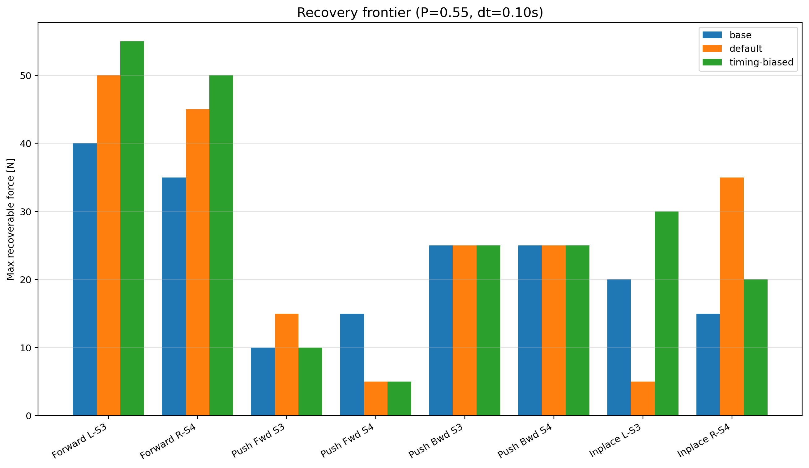
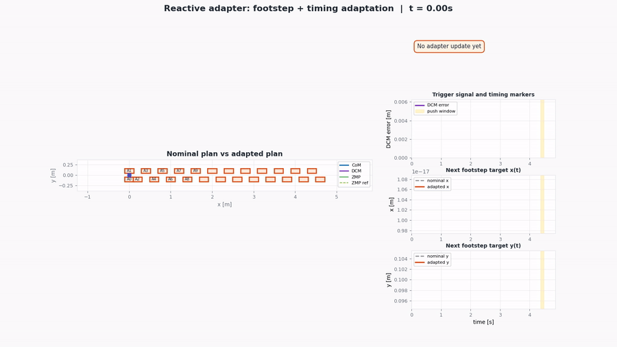
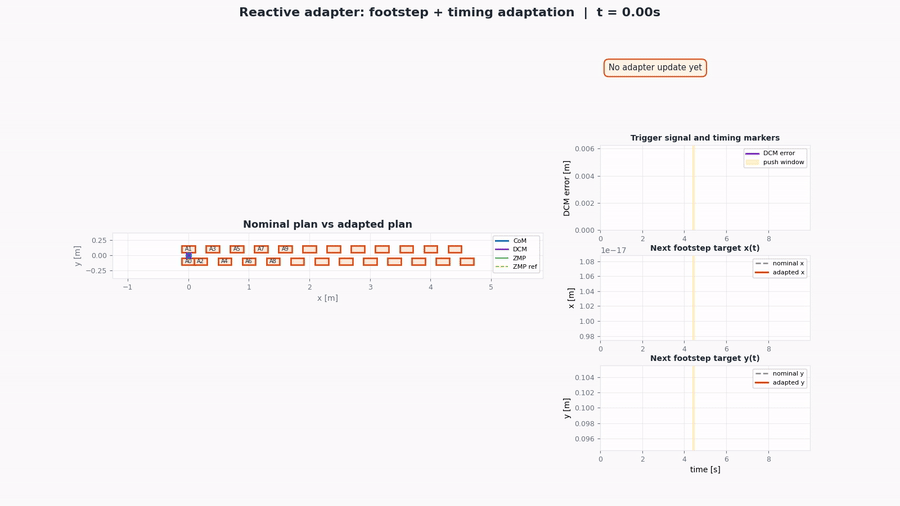

# Reactive Push Recovery for IS-MPC Humanoid Locomotion


An online **reactive footstep and step-timing adaptation layer** for humanoid locomotion based on Intrinsically Stable Model Predictive Control (IS-MPC).

The controller monitors the robot's Divergent Component of Motion (DCM) and viability state and, when a disturbance threatens walking stability, solves a constrained **Quadratic Program (QP)** to adapt the upcoming step while preserving the nominal walking plan whenever intervention is unnecessary.

The objective is simple:

> **increase push-recovery capability without replacing the underlying walking controller.**

---

## Push-Recovery Results

| Scenario | Baseline | Default Adapter | Timing-Biased |
|---|---:|---:|---:|
| Forward — L-S3 | 40 N | **50 N** | **55 N** |
| Forward — R-S4 | 35 N | **45 N** | **50 N** |

The default reactive controller substantially increases the maximum recoverable disturbance, mainly through **online footstep relocation**.

The timing-biased configuration is included as an ablation showing that more aggressive timing adaptation can further enlarge the recovery region, although it is more sensitive to tuning.

<p align="center">
  
</p>

### Qualitative Comparison

<p align="center">
  
  
</p>

---

## Controller Architecture

```text
Nominal IS-MPC walking plan
          │
          ▼
   Robot state / CoM
          │
          ▼
   DCM + viability check
          │
      ┌───┴────┐
      │ stable │ disturbed
      ▼        ▼
 Nominal     Reactive QP
  plan       adaptation
               │
       ┌───────┴────────┐
       ▼                ▼
 Footstep shift     Step timing
       │                │
       └───────┬────────┘
               ▼
        Updated plan
               │
               ▼
      Whole-body control
```

The adapter maintains both a **nominal plan** and an **active plan**.

During normal walking, the nominal trajectory is preserved. Adaptation is activated only when the current state leaves the desired viability region or the DCM deviation becomes sufficiently large.

---

## Reactive QP

The optimization variable is

\[
z =
[\Delta x,\Delta y,\tau,b_x,b_y,s_x,s_y]^T
\]

where:

- \(\Delta x,\Delta y\) modify the next footstep position;
- \(\tau\) modifies the step timing;
- \(b_x,b_y\) represent DCM-offset variables;
- \(s_x,s_y\) provide bounded slack for feasibility.

The quadratic objective penalizes deviations from the nominal plan:

\[
\min_z
\quad
w_p\|\Delta p\|^2
+
w_\tau \tau^2
+
w_b\|b\|^2
+
w_s\|s\|^2
\]

subject to constraints encoding:

- DCM consistency;
- admissible step position;
- admissible timing changes;
- viability bounds;
- slack limits.

The QP therefore searches for the **smallest corrective modification capable of recovering a feasible walking state**.

---

## DCM-Based Activation

The controller computes the Divergent Component of Motion as

\[
\xi = c + \frac{\dot{c}}{\eta}
\]

where \(c\) is the center-of-mass position.

Rather than solving the reactive optimization continuously, the adapter is gated through:

- DCM deviation;
- viability conditions;
- single-support phase;
- warm-up periods;
- freeze and cooldown logic.

This prevents unnecessary plan oscillations and keeps nominal walking unchanged whenever possible.

---

## Adaptation Strategies

### Baseline

Standard IS-MPC locomotion without online reactive modification.

### Default Adapter

Jointly allows:

- footstep relocation;
- limited timing adaptation;
- DCM-offset adjustment.

This is the main robust controller configuration.

### Timing-Biased Adapter

An experimental configuration that increases the relative importance of timing adaptation.

It is useful as an **ablation study** to understand how step timing affects the recovery frontier.

---

## Running the Experiments

Install the dependencies:

```bash
pip install -r requirements.txt
```

Example baseline simulation:

```bash
python3 simulation.py \
  --headless \
  --steps 1000 \
  --profile forward \
  --force 45 \
  --duration 0.10 \
  --direction left \
  --push-step 3 \
  --push-phase 0.55 \
  --push-target base
```

Enable the reactive adapter with:

```bash
--adapt
```

The repository also contains scripts and recorded results used to generate the push-recovery comparisons.

---

## Repository Structure

```text
.
├── step_timing_adapter.py       # Reactive QP adaptation
├── ismpc.py                     # IS-MPC walking controller
├── footstep_planner.py          # Nominal footstep planning
├── foot_trajectory_generator.py # Swing-foot trajectories
├── inverse_dynamics.py          # Whole-body control
├── simulation.py                # Simulation entry point
├── docs/
│   └── assets/                  # GIFs and evaluation plots
└── ...
```

---

## What This Project Demonstrates

- Humanoid Locomotion
- Model Predictive Control
- Divergent Component of Motion
- Push Recovery
- Quadratic Programming
- Online Trajectory Adaptation
- Constrained Optimization
- Viability-Based Control
- Whole-Body Robotics
- Experimental Controller Evaluation

---

## Key Takeaway

The project shows how a nominal predictive walking controller can be augmented with a lightweight **event-triggered optimization layer**.

Instead of replanning the entire locomotion problem after every disturbance, the system selectively adjusts the next step position and timing only when the current walking state approaches the boundary of viability.

The result is a significantly larger push-recovery region while retaining nominal IS-MPC behavior during undisturbed walking.

